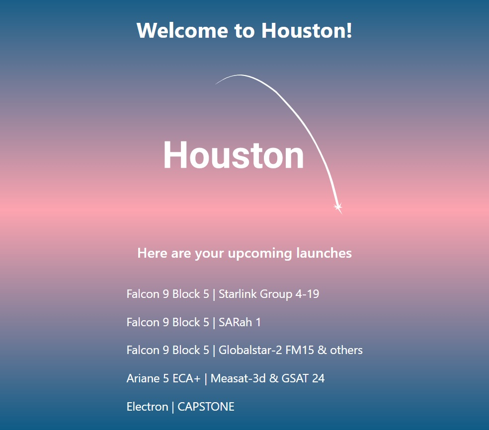

This will be a React app that uses data from some third party API to show the user
upcoming rocket launches. 

The backend will be a Node.js server running an Express app. 

The first version of the app won't need to persist data in a database. 

## Origin story

My colleague [Rob Stoelhorst](https://robertstoelhorst.com/) and I wanted to work on something together. Rob loves rockets. I'm fascinated by space. So we decided to work on a rocket launches website together!

I wanted to learn more about UI/UX design so started taking a course on it. I created some initial sketches, some userflows and a sitemap. I even created the basic logo above based on [this photo.](https://unsplash.com/photos/-p-KCm6xB9I)
### Sketches

### User flows

### Sitemap

## Current state of the website

* HTTP Node.js server (to be later replaced with an HTTPS web server)
* Express app with single route to get latest launches, which uses a launches controller (to handle the incoming request and outgoing response), which uses a launches model to make the network request to the third party API 
* CORS middleware to whitelist client origin
* .env files to create environment variables
* Fullstack package.json to bring up the React frontend and Node backend in a single command 
* TailwindCSS for styles

## Setup

1. In the root of this repo, you'll find a `package.json` file with a `install` convenience script. Running `npm run install` will install both frontend and backend dependencies.  
2. Run `make .env`, which will copy the `server/.env.template` and `client/.env.template` to `.env` files.

## How to run the application stack

In the root of this repo, issue `npm run watch`. 
